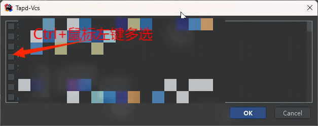

# Tapd-Vcs
用于在IDEA中vcs提交时快速关闭tapd中相关问题并将相关问题和链接复制到commit中的IDEA插件,代码目前没有整理，也许有空会整理一下maybe φ(゜▽゜*)♪ **对了目前只支持SVN  其他的需要等后续完善支持  毕竟我现在主要用SVN ಥ_ಥ**
# 如何设置
 **最最重要的一点 一定要打开创建人如下图所示 否则是无法把问题踢回创建人的**

# 如何使用
### 点击提交后出现提交面板，点击图标打开bug列表

### 弹出bug列表面板  可以使用ctrl+鼠标左键进行多选

 最后插件就会自动将bug描述和链接写入Commit Message内啦，在点击提交后就会自动去关闭选择的问题。
